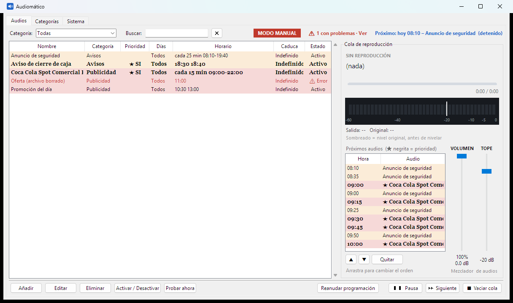
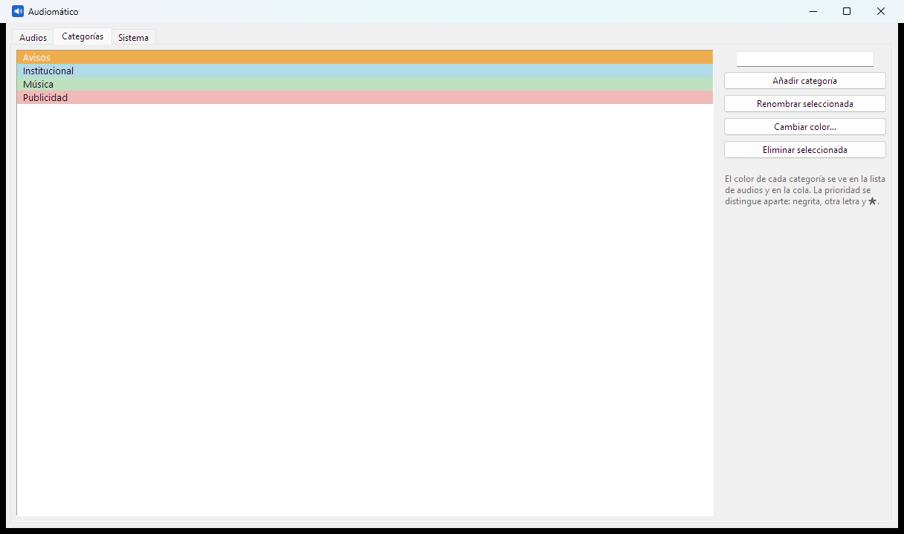
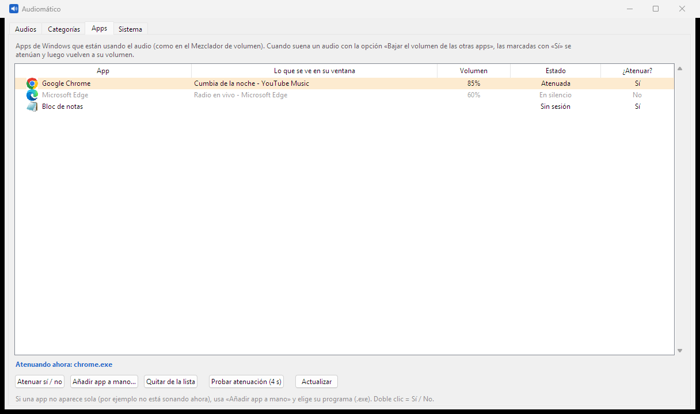

# Audiomático

Programador de audios para Windows. Reproduce tus audios (MP3, WAV, OGG, FLAC) a las horas que indiques, con cola, prioridades y control de volumen. Funciona desde **Windows 7** en adelante, en 32 y 64 bits.



## Qué hace

- **Arrastrar y soltar.** Arrastra audios o carpetas a la ventana para añadirlos. Avisa si el archivo o el nombre ya existe, para no repetirlos.
- **Programación flexible.** Cada audio combina tres reglas independientes: horas exactas (10:30, 18:40), minutos de cada hora, y repetición cada N minutos dentro de una ventana (por ejemplo, cada 15 min de 09:00 a 22:00). Suena cuando se cumpla cualquiera.
- **Formato de 12 o 24 horas.** Se elige en Sistema; las horas se pueden escribir como `18:40` o `6:40 PM`.
- **Días y vigencia.** Elige los días de la semana y hasta cuándo vale cada audio.
- **Prioridad con damper.** Un audio con prioridad suena primero y baja un poco el sonido general (otras apps y audio en curso, por defecto al 50 %, ajustable) para resaltarlo. Al terminar, el volumen sube de forma progresiva. Hay una espera configurable antes del siguiente audio en cola.
- **Cola visible.** Se puede reordenar arrastrando, quitar elementos, pausar y saltar al siguiente.
- **A prueba de fallos con los audios.** Lee WAV de cualquier variante (8/16/24/32 bits, coma flotante, A-law, varios canales), audios muy bajos o con largos silencios y audios muy largos (suenan en streaming). Si un archivo falta o no se puede leer, lo avisa con un ⚠ en la lista y no detiene el resto. Opcionalmente recorta el silencio sobrante al inicio y al final.
- **App seleccionada en la pantalla principal.** Eliges una app en la pestaña **Apps** (por ejemplo YouTube Music en tu navegador) y aparece con su icono, la canción (solo el título), su línea de reproducción y su medidor en vivo. En Windows 10/11 muestra también el artista y la duración exacta; en Windows 7 muestra el título y el tiempo transcurrido. La línea de tope baja (naranja) cuando suena un audio de prioridad, para ver que la atenuación funciona.
- **Cola con botones reales.** «Ahora» reproduce ya un audio (de la cola o programado), «Saltar» omite una emisión programada solo esa vez, ▲ ▼ y arrastrar reordenan la cola y «Quitar» la saca.
- **Espera entre audios.** Entre dos audios normales programados a la misma hora se respeta la espera configurada; los de prioridad no esperan.
- **Atenúa otras apps (YouTube Music, Spotify, el navegador…).** Cada audio tiene la opción «Bajar el volumen de las otras apps»; la pestaña **Apps** muestra qué apps usan el audio (con su icono, la ventana y su volumen), permite elegir cuáles se atenúan, añadir una a mano y probar la atenuación. Si el programa se cierra de golpe, al abrir devuelve su volumen a las apps que hubieran quedado bajas.
- **MP3 de cualquier tipo**, incluidas las voces sintéticas (MPEG-2, mono, 24 kHz), con un decodificador de respaldo. `Audiomatico.exe --diagnostico archivo.mp3` genera `diagnostico.txt` con qué se puede leer y qué no.
- **Modo manual.** Un botón detiene la programación sin cerrar el programa (con aviso rojo para no olvidarlo).
- **Revisión de la programación.** Avisa de audios que caen en el mismo minuto, que empezarían tarde porque el anterior no terminó, o que duran más que su repetición.
- **Nivelación de volumen.** Cada audio se mide y se guarda al mismo nivel, sin distorsión. El fader **TOPE** fija en vivo el nivel máximo en decibelios.
- **Volumen propio.** El fader **VOLUMEN** mueve el control de Audiomático en el Mezclador de volumen de Windows, sin tocar el volumen general del equipo.
- **Próximos audios.** La cola muestra lo que espera turno y lo que está programado más adelante, cada uno con su hora.
- **Vúmetro** animado que muestra lo que suena y hasta dónde llegaría sin nivelar.
- **Colores por categoría.** La prioridad se distingue aparte, con letra negrita y ★.
- **Fundidos** al iniciar y terminar cada audio.
- **Actualizaciones.** Busca versiones nuevas en GitHub (una vez al día o cuando lo pidas), verifica la descarga con su huella SHA-256 y se actualiza solo.
- Se queda en segundo plano junto al reloj, puede iniciar con Windows y abrirse a una hora programada.





## Instalación (usuarios)

Descarga desde la sección **Releases** el instalador que corresponda y ejecútalo:

- **Windows 7 / 8** (o si dudas): `Instalar_Audiomatico_x.y.z.exe`. Sirve en cualquier Windows.
- **Windows 10 / 11**: `Audiomatico_Win10-11_x.y.z.exe`. Igual, pero además muestra el artista y la duración exacta de la canción de otras apps.

El programa elige solo el instalador correcto al actualizarse. Tus datos quedan en `%APPDATA%\ProgramadorAudios` y no se borran al desinstalar. Las versiones siguientes se pueden instalar desde el propio programa (Sistema → Buscar actualizaciones).

## Ejecutar desde el código

Requiere **Python 3.8** (el último que soporta Windows 7).

```bash
py -3.8 -m venv .venv
.venv\Scripts\python.exe -m pip install -r requirements.txt
.venv\Scripts\python.exe programador_audios.py
```

## Compilar e instalador

`compilar.bat` genera dos variantes de 32 bits con PyInstaller, cada una en su propio entorno virtual: `dist\win7\Audiomatico.exe` (sin `winsdk`, para Windows 7 en adelante) y `dist\win10\Audiomatico.exe` (con `winsdk`, `requirements-win10.txt`). Los instaladores se crean con [Inno Setup](https://jrsoftware.org/isinfo.php) (`instalador.iss`). Hace falta Python 3.8 de 32 bits.

## Requisitos en Windows 7

Necesita el **Service Pack 1** y estas actualizaciones de Windows (Python 3.8 las exige; un Windows 7 al día ya las tiene):

- **KB3118401** (o su antecesora KB2999226): Universal C Runtime. Sin ella: «falta api-ms-win-crt-runtime-l1-1-0.dll».
- **KB3063858** (o su antecesora KB2533623): carga segura de DLL. Sin ella: «DLL load failed … El parámetro no es correcto».

## Publicar una versión nueva

1. Sube el número en `VERSION` (`programador_audios.py`) y en `#define Version` (`instalador.iss`).
2. Ejecuta `compilar.bat`.
3. En GitHub crea una *Release* con el tag `vX.Y.Z` y adjunta los dos instaladores: `Instalar_Audiomatico_X.Y.Z.exe` y `Audiomatico_Win10-11_X.Y.Z.exe`. Publícala primero como *prerelease* y promuévela cuando se confirme que abre en Windows 7.

El programa instalado detecta la release, descarga `Audiomatico_Win10-11_*` en Windows 10/11 o `Instalar_Audiomatico_*` en cualquier otro y comprueba el SHA-256 que GitHub calcula para cada archivo adjunto antes de ejecutarlo.

## Licencia

El código se publica bajo **PolyForm Strict 1.0.0** (ver `LICENSE`): puedes leerlo y usarlo para fines no comerciales, pero no modificarlo ni redistribuirlo. El programa instalado se rige por `LICENCIA_USO.txt`.

